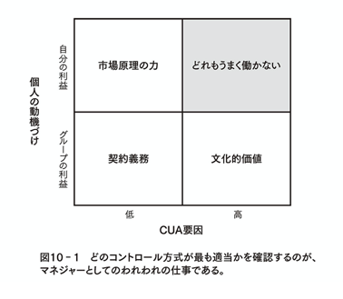

# 対象書籍

- HIGH OUTPUT MANAGEMENT
- アンディ・グローブ著
- https://www.amazon.co.jp/dp/B01MU055XH/ref=cm_sw_r_tw_dp_bCY.FbC2ZEQR5

# メモ
## 付箋を貼った箇所
### 序章

マネージャーとしての意識ができているかの質問

- 自分の仕事は本当の価値を付与しているか、単なる情報のハブになっているか
  - 付加価値をどうやって高めようとしているのか
- 自分の周囲で起こっていることに対して常にアンテナを張り、情報収集をしているか
- 新しいアイデア、手法、技術を常に試みているか

### 生産の基本原理

- どのような問題に対しても、プロセスの中でできる限り”価値が最低”の段階で問題を発見して解決すべき

### マネジメントのテコ作用

- マネージャーのアウトプット方程式
  - マネージャーのアウトプット＝自組織のアウトプット＋自分の影響力が及ぶ隣接組織のアウトプット
- マネージャーは常に多くのボールを空中に投げておき、自部門のアウトプットを最高にあげると思われる活動にエネルギーを注ぐ
  - レバレッジが最大限効きそうな活動に集中する
    - 大勢の人が一人のマネージャーに影響を受ける場合、レバレッジは大きい
    - 特定の人の長期にわたる活動が、マネージャーの短いが的を射たアドバイスによって影響される場合、レバレッジは大きい
- 最後までフォローしない権限委譲は”職務放棄”
  - マネージャーは仕事の完了に対して常に責任を持ち続ける

### ミーティング
- マネージャーのMTGは大きく二つに分類される
  - プロセス中心MTG
    - 知識の共有化・情報交換がメインで、定常
  - ミッション中心MTG
    - 意思決定がメインで、非定常
- 1on1で何をすべきか
  - メンバーに何が起こっているのか、何に困っているのかを説明することを手助けする
  - マネージャーはコーチとして振る舞い、問題解決の支援を行う
- 意思決定の自問自答
  - どのような意思決定をする必要がある？
  - いつ決める必要がある？
  - 誰が決める？
  - 意思決定をする前に相談すべき人は？
  - 意思決定を承認・否認するのは誰？
  - 意思決定を知らせる必要があるのは誰？

### プランニング
- MBOを成功させるために必要な自問
  - 自分はどこへいきたいのか？（Objective）
  - そこへ到達するために自分のペースをどう決めるか？（KeyResult）

### ハイブリッド組織
- グローブの法則
  - 共通の事業目的をもつ全ての大組織は、最後にはハイブリッド組織形態に帰着する
  - ハイブリッド組織とは、職能別組織と機能別組織がマトリクス構成になっているような形状の組織を指す

### コントロール方式
- 職場環境での行動も、目に見えない３つの力でコントロールされうる
  - 自由市場原理の力
  - 契約上の義務
  - 文化的価値

### スポーツとの対比
- 高いレベルで成功を実現するには、マズローの欲求段階でいうところの下位欲求は満たされている状態でなければならない
- 人を駆り立ててベストをつくさせる内面的な二種類の力
  - 「能力」に突き動かされる
  - 「達成欲求」に駆り立てられる
- 伸びようとする欲求が自発的に現れない時は、マネジメントとして手を添える必要がある
  - MBOで高いレベルの目標を設定して、そこに到達するために努力させるなど

### 人事考課
- 人事考課の目的は「部下の業績を改善すること」
  - 技能を押し上げるために何が足りないのか
  - 高い技能水準を目指すためにどのようにモチベートするか
- 査定の内容を伝える時に心に止めておく3L
  - Level（相手と同じレベルに立つ）
  - Listen（相手のことをよく聞く、理解する）
    - 自分が伝えたいことが相手の脳内に正しく形成されるために必要な知覚をフル活用する
  - Leave Yourself（主観は持ち込まず、客観視する）

# 行動改善
多くは一度に実現できないので、特に自分ができていない３点に絞って行動改善を行う
それが週間として身についた実感が持てたら、また別の目標を設定する
1. 情報収集を怠らず、必要な意思決定が即座にできるようにアンテナを張り続ける
    - 毎日1時間、情報収集の時間を設け、ドキュメントやチャットを徘徊する
2. 自分の行動の影響が最も広範に働く、レバレッジの効く仕事に集中する
    - 作業レベルのタスクは極力持たない
3. メンバーのモチベート、成長促進に寄与する価値貢献を最優先とする
    - MBOを取り入れたジュニアメンバーの育成
    - ミドルメンバーには教育ミッションを意識させる