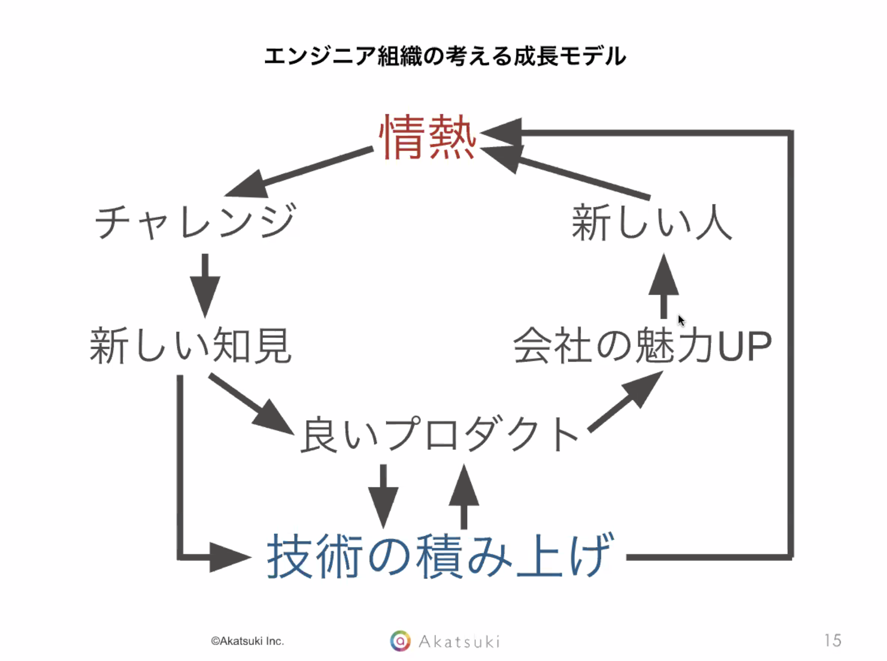
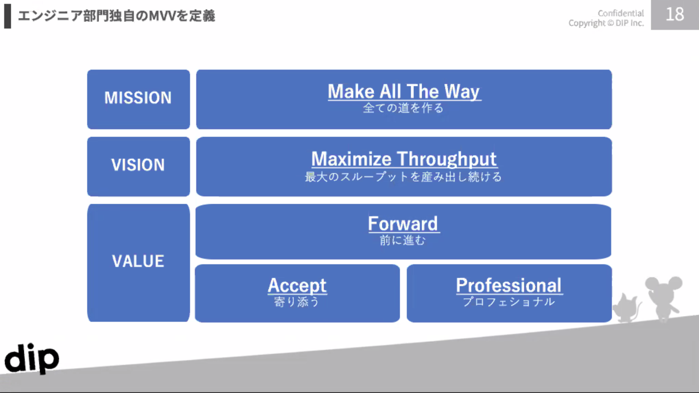
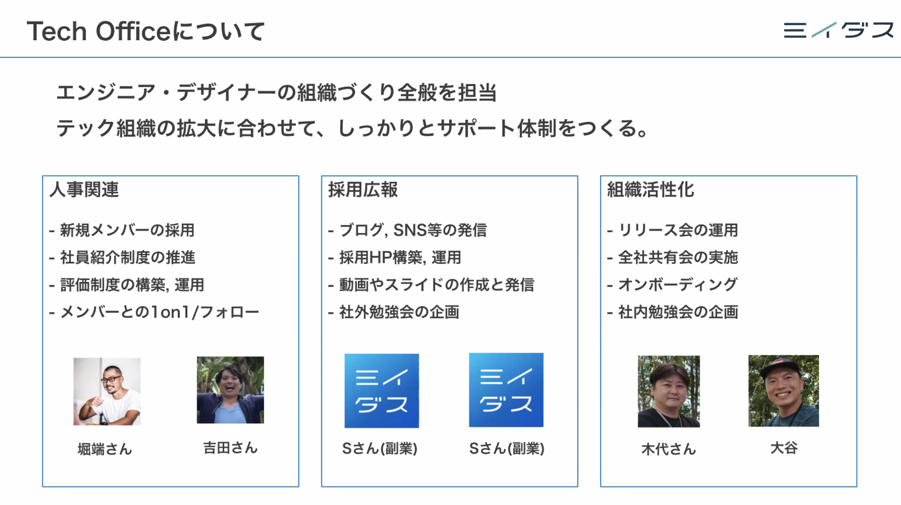

## イベント概要
https://miidas-tech.connpass.com/event/201191/
- エンジニア組織構築に日々携わっているVPoEなどが対談形式で組織構築の工夫など話すイベント

## 徒然メモ
- イベントを聴きながら、個人的に刺さったポイント

### 個人の情熱が組織の成長に繋がる
- Akatsukiのエンジニア組織の根底にある考え方
- 新しいチャレンジ、技術の積み上げが回り回っていいプロダクト・いい組織に還元されていくというサイクルを大事にしている

  

- 今自分も組織構築の中で個人のモチベーションはかなり重視していて、MBOを導入したり1on1でコーチングしたりを整えて行っているところなので、それが最終的にいいプロダクト・いい組織につながっていくという考えを組織のベースにおいて言語化しているのがすごくいいと思った
- [関連する参考記事](https://hackerslab.aktsk.jp/2019/12/10/112504)

### エンジニア組織独自のMVV
- dipが取り入れている、エンジニアとしての期待行動を言語化したもの（メルカリを参考にしたらしい）
- エンジニアファーストを謳っている組織とかだと、往々にしてエンジニアが非エンジニア（あんまりこの言葉好きじゃないけど）に対して横柄になったり、組織として期待する行動を取らなかったりすることがあるので、エンジニア向けに期待される行動が言語化されていると、よくない行動をとったメンバーへのフィードバックもしやすいと思った

  

- このMVVの中で、 `Mission : 全ての道を作る` の部分がいい
  - 事業として前に進めないといけないこと、技術負債に対して取らないといけないアプローチ、全てひっくるめて道を作っていくことこそが期待される行動価値だということを端的に示している
  - そこに合わせるように、 `Value : Accept` があって、エンジニアとしてやりたいことに閉じず、ちゃんと会社・事業としてやるべきことに寄り添っていく、そのためのコミュニケーションを重視することが読み取れて良い

### エンジニア組織運営で行っている具体的な活動
- ミイダスのTech Officeが実施している組織づくりの具体的な活動を３本の柱で整理
  - 人事関連
  - 採用広報
  - 組織活性化
- 一つ一つの活動を取ると、弊社でも取り組みとしてはできているものが多いが、規模が大きくなったり、継続的に運用していく上での課題が見え始めている
- こうやって「エンジニア組織づくりとして、何を業務範囲にしますよ」がちゃんと整理されているのはすぐにでも真似したい
  

### 評価制度上の工夫
- 各社一般的にやってそうだったのは、グレードを定義して、そこに「期待する行動」をグレードごとに記載し、評価としては個別の技術に対する能力というよりも行動として期待できたレベルを達成しているか、ということ
- 特徴的なことをやっている例として、Akatsukiは被評価者が評価者を選択できるらしい
  - 「この人の評価なら納得できる」という心象で評価者を選択することができ、それによって評価に対する納得感を醸成することが目的
  - 公平性が担保できるのか？とか、それでマネージャーは機能するのか？とか、運用上気になるポイントはあるが、文化的に性善説・性弱説に基づいた組織ができていて、その上での導入とのことだった
- dipは月に一度評価者によるPRイベントを個別にやっているらしい
- どちらの例も重視しているのは「納得感の醸成」。評価の課題はどこにいってもついて回りそうだと感じた

### 既存メンバーと新規メンバーのハレーション
- 組織拡大の過程で往々にして発生する既存メンバーと新規メンバーのハレーションを如何に解消するか、あるいはエンジニアメンバーとビジネスメンバーのハレーションを如何に解消するか、という話題
- 新メンバーのアサインでの工夫
  - 新しい人が入ってきたときに、既存の業務のキャッチアップ負荷が高い、現状の社員では持ち合わせていなかったスキルを持っている、などの理由で新しいプロジェクトにアサインしたりすることが多いが、メルカリでは意識的にこれを避けている
  - 理由は、新しいプロジェクトなどの挑戦的なミッションは既存のメンバーの中にもやりたいと思っている人がいるはずで、その心象を蔑ろにして新しいメンバーにばかり依頼すると、そこに断絶が発生しうるため
  - 新しいプロジェクトが立ち上がるなどのタイミングで、既存メンバーに挙手してもらったり、長い期間同じ業務で膠着している人がいたら積極的に声を掛けるなどしてモチベーションコントロールを実施している
  - 新しいメンバーは明確な立ち上がり期間を設けて、既存メンバーの穴埋めなどにも活用していく（入社時の期待値調整は必要だなと思った）
- 入社ジェネレーションギャップについて
  - 入社時期によって会社に対して持っている情報量が異なることから生まれる情報の断絶
  - 新しく入ってきたメンバーは、過去の活動に対して強いリスペクトを持たないといけない
    - 例えば技術的な負債など、作りたくて作っているわけではない
    - 当時のリソースや事業状況、メンバーのスキル感などから、常に考えうる最適な選択としてプロダクトが積み上げられてきているはず
    - 新しく入ってきて、その辺りのコンテキストがない状態で「ここはこうあるべき」などといったコミュニケーションを取ると、それがハレーションに繋がる
    - エンジニア・ビジネス間も同様で、相互のリスペクトがハレーション防止に最も有効的
    - ここは採用のタイミングでなるべく見極めていく必要がある