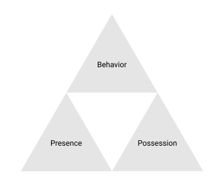
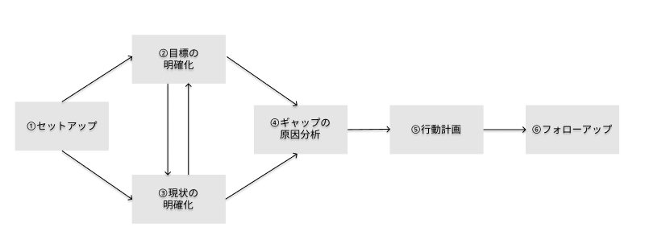

# 書籍

# 本から得た知識のインデックス
## コーチングとは何か
- クライアントの目標を明確にし、クライアント自身でそこに向かって成長していけるように支援すること
  - クライアントが自らの力で目標を達成することが重要

## コーチが持つべき3つの視点

### Possession
- どのような知識・スキル・人脈を持っているか？
- 現状持っているPossessionに加えて、目標達成のために身に付けるべきPossessionも明確にする

### Behavior
- どのような行動をしているか？
- 行動が起きるまでに生じる4つの壁について理解する
  1. 目標へのコミットメントが低いために行動が起こらない
      - Presenceが寄与している
  2. やる気はあるものの、何をしたらいいかわからない
      - Possessionが不足している
  3. 知識・スキルをどのように活用すればいいのかわからない
      - Possessionの活用方法を探る／使っていないPossessionを提示する
  4. コンフォートゾーンから抜け出せない
      - 宣言して、現状維持のバイアスから抜け出す

### Presence
- どのような価値観・信念・ものの捉え方をしているか？
  - 体験によって形成され、自覚するのが難しい
  - 根気よく対話を重ねることで意識の表層に持ってくる

## コーチングの三原則
### 双方向
- 双方向の会話で、無意識を顕在化させ、たくさんアウトプットさせる
  - アウトプットの過程でオートクライン（自発的な気付き）が得られることを狙う
  - オートクラインを起こすためには、コーチとクライアントとの間で信頼関係が必要
  - オートクラインを戦略的に引き起こすために、「質問する、その質問に対して質問する・・・」を繰り返す

### 継続性
- コーチングセッションはマラソンの給水ポイント
  - エネルギーをチャージする（意欲の向上）
  - これまでのルートを振り返り、軌道修正（ズレの修正）
  - ゴールにたどり着けるようにサポート
- 最もモチベーション高く課題に取り組むためには、マズローの欲求段階における下位の欲求は満たされている必要がある
  - 所属の欲求を満たすアクノレッジメント
    - クライアントを認めていることを言葉・態度で発信する
    - 小さな変化にも気づく
  - 自我の欲求を満たすメッセージング
    - Youメッセージより、I/Weメッセージ

### 個別対応
- コーチングは知識やテクニックをフルに駆使しても、枠にはめて対応することはできない
- それでも、ある程度の指針を得るために、クライアントをソーシャルタイプで分類して適切なコミュニケーション方法を探る
  - ソーシャルタイプも、枠に嵌めきるのではなく、一要素として考える
  - ソーシャルタイプはセッションのたびに見直す必要がある

## コーチングプロセス

### 目標の明確化
- have to の目標ではなく、 want to の目標を探る
  - 過去の自分や、周囲の人との対比の中で探していくと見つけやすい
- 業務目標と同時に成長目標も設定する
- 自分でコントロールできる目標を設定する

### 現状の明確化
- 自分の行動を録画してみて客観視する
- 周囲の人からのフィードバックを積極的にもとめる

### ギャップの原因分析
- 「他責」ではなく、「自責」で考える
  - 本当に自分の責任かどうかは置いておいて、「自分の行動で改善できるとしたらどうするか？」という視点に立つのが大事
  - 他責思考では成長が生まれない

## 代表的なコーチングスキル
- 聞く
  - ノンバーバルな情報を受け取る
  - 聞いている、というサインを送る
- ペーシング
  - 信頼感や安心感を醸成するために相手に波長を合わせる
- 質問
  - クローズドクエスチョン／オープンクエスチョンを使い分ける
  - チャンクダウン／スライドアウトで思考の深さ・幅を調整する
- アクノレッジメント
  - 存在承認：相手の存在を認める
  - 成長承認：相手の成長に気づいて承認する
  - 成果承認：成果を伝える
- フィードバック
  - 客観視点・主観視点の両方を駆使する
- 提案
  - ストーリーで伝える
- 要望
  - 短く、簡潔に伝える

# Next Action
- ここで得られたのは単なる知識のインデックスなので、これを経験として定着させる必要がある
- 具体的な行動は下記
  - 実際のメンバーとの1on1の場で、MBOの振り返りを通じて、上記の知識・テクニックを活用したコミュニケーションを計り、定性的な効果を見る
  - コーチングの実践例的な書籍（[1兆ドルコーチ](https://www.amazon.co.jp/gp/product/4478107246/ref=ppx_yo_dt_b_asin_title_o01_s00?ie=UTF8&psc=1)）を読み、先人の行動と得られた知識とを紐つけていく