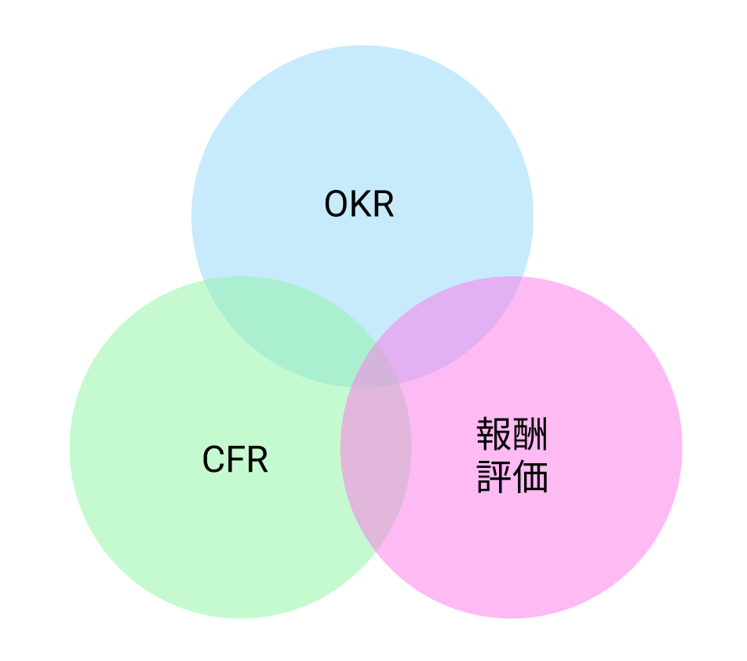

# 書籍
[Measure What Matters](https://www.amazon.co.jp/Measure-What-Matters-%E4%BC%9D%E8%AA%AC%E3%81%AE%E3%83%99%E3%83%B3%E3%83%81%E3%83%A3%E3%83%BC%E6%8A%95%E8%B3%87%E5%AE%B6%E3%81%8CGoogle%E3%81%AB%E6%95%99%E3%81%88%E3%81%9F%E6%88%90%E5%8A%9F%E6%89%8B%E6%B3%95-%E3%83%A1%E3%82%B8%E3%83%A3%E3%83%BC%E3%83%BB%E3%83%9B%E3%83%AF%E3%83%83%E3%83%88%E3%83%BB%E3%83%9E%E3%82%BF%E3%83%BC%E3%82%BA/dp/4532322405/ref=tmm_hrd_swatch_0?_encoding=UTF8&qid=&sr=)

# 概要
アンディ・グローブの元でOKRの源流を学び、Googleでそれを進化させたベンチャー投資家であるジョン・ドーアが、Googleをはじめとするシリコンバレーのいくつもの企業で実施されてきたOKRの導入や管理のエピソードと共に、そのエッセンスを記載

# 付箋を貼った場所
## OKR
- 「あなたが何を知っているかなど、どうでもいい。知識は二の次。何より重要なのは実行・実績」
  - 何を知っているかで評価するのは筋が違う。何を成し遂げてきたか、どんな主体的なアクションを取っているかの方が遥かに重要
- 「以下を尺度として」
  - KRsは明確に測定できる指標である必要がある
  - Objectiveを定義する際にも、「以下を尺度として」という文言をテンプレートに入れると、自然とKRsは測定可能なものとなる
- 「ダメな会社は危機で潰れる。いい会社は危機を乗り切る。最高の会社は危機を糧にする」
- KRsには、数値目標と、その対になる品質目標を設定する
  - 数値目標だけを設定してしまうと、品質が疎かになり、不正の原因などになりうる
  - 測定可能な品質目標と同時に数値目標を達成させることで、高品質な成果を期待通りに納品することができる
- 「優れた経営とは、一見重要度が同じに見えるいくつもの活動から、圧倒的に影響力の大きいものを2~3ピックアップしてそこに集中することである」
- スモールスタートでOKRを浸透させる
  - 20人程度の会社であっても、一気にOKRを導入するのは難しい（個人OKRなど最初はほぼ機能しない）
  - 公式なOKRは、最初はボードやマネージャーから始めて、その様子を公開して徐々に浸透させていくことで文化として根付かせていく
- 目標の一部がボトムアップで上がってくる余地を残しておく
  - 過度なアラインメントは想像力の剥奪に繋がる
    - アラインメント：並べて方向を揃えること
    - 突き詰めると、会社が個人に何を期待しているのかをわからせること
  - 目標の一部がボトムアップで上がってくることを期待して促すことで、クリエイティブで非連続な成長につなげることができる
- 部門間のアラインメントの重要性
  - 組織全体で大きな目標を達成するには、部門を超えた協力（部門間のアラインメント）が必要不可欠
  - 各Objectiveの中で、他のチームが担当するObjectiveに依存するものは何かを明確にし、協力を仰ぐ
- OKRの番人
  - OKRを導入して、意味を成すように運用するには、全員が一丸となって協力する必要がある
  - 離脱や例外は許されない
  - 全体で確実にOKR運用をしていくために、明確な「OKRの番人」を設定するのが好ましい
    - CTO室とかがいいかな
  - OKRの番人は指令を出す立場ではない、OKRの実施が如何に重要か、個人の業務に対してもどれだけ効果があるかをメッセージングして、能動的に取り組んでもらえるように協力を仰ぐのが目的
- 大きな石から容器に入れる
  - よくあるエピソードのやつ
  - 本当に重要な目標に絞って集中できる状態にしないと、小さな石を詰め込んで容器がいっぱいになってしまう
- OKRは対話を促す
  - コントリビューターとの1on1では業務のことは原則話さない
  - コントリビューターのパフォーマンスを向上させるような質問を促す
    - 何をしているときが一番楽しいか？
    - 何をしているとエネルギーを消耗するか？
    - 理想の仕事はどんなものか？
- 企業文化の価値観に従っている人、すなわち知的な企業市民は、同じような状況で一貫した行動を取る
  - 経営陣は信頼の基盤となる共通の価値観・目標・手法を開発して育てていかなければならない
  - 明文化し、率先して規範となる
  - 「正しい人たちをバスに乗せ、間違った人たちをバスから下ろし、正しい人たちに正しい座席を割り振る」

## MBO vs OKR
| MBO | OKR |
| --- | --- |
| 「何を」 | 「何を」「どのように」 |
| 年次 | 四半期ごと、あるいは月次 |
| 非公開 | 公開・透明性 |
| トップダウン | ボトムアップ・あるいは水平展開 |
| 報酬と連動 | 報酬とはほぼ完全に分離 |
| リスク回避 | 積極的・野心的 |

## アンディ・グローブ流OKRの要諦
- **絞り込む**
  - 一握りの目標に絞りこんで集中することで、何に「Yes」と言って何に「No」と言うかを明確にする
  - 個々のObjectiveに連動するKRsは5つ以内
- **目標はボトムアップで**
  - マネージャーと相談しながら、OKRのほぼ半分は自分で決める
- **押し付けない**
  - 目標達成を最大化するには、協力的な合意形成が不可欠
- **常に柔軟な姿勢で**
  - 事業環境の変化に合わせてOKRも柔軟に変化させる
- **失敗を恐れない**
  - 「手の届かない目標に対して努力するとき、アウトプットは伸びる傾向にある」
- **手段であって、武器では無い**
  - リスクテイクを促し、力の出し惜しみを防ぐには、OKRとボーナスは切り離すべき
- **辛抱強く、決然と**
  - システムが軌道に乗るまでには4~5半期（2~3年）はかかるかもしれないという覚悟で試行錯誤する

## OKRの二つのカテゴリー
- コミットする目標
  - 経営上の重点指標と結びついている
  - 期限内に100%達成されなければならない
  - プロダクトのリリース・販売目標・収益など
- 野心的な目標
  - 壮大なビジョン・高いリスク・未来志向の発送を反映する
  - 4割くらいは失敗に終わると思っておいて過言ではない

## CFR（継続的パフォーマンス管理）
- Conversation
  - パフォーマンス向上を目的にマネージャーとコントリビューターで行われる真摯な会話
- Feedback
  - プロセスを評価し、将来の改善につなげるための双方向のコミュニケーション
- Recognition
  - 大小様々な貢献に対して、しかるべき個人に感謝を伝える

## OKRと評価を切り離す

- Googleでは、OKRが評定に占められる割合は1/3以下
- コントリビューターは少なくとも6週間に1回はパフォーマンスに関するFeedbackを受ける（チェックイン） 

# OKR導入を主導する立場として自問すべきこと
- 透明性がなぜ重要なのか
  - なぜ全てのチームの人たちに目標を知ってもらう必要があるのか
- 真の説明責任とは何か
  - 他者の失敗に対して敬意を持って説明責任を求めることと、自らの失敗に対して謙虚に説明責任を果たすことの違いは何か
- OKRはマネージャーが「他者を通じて業務を遂行する」のに、どのように役立つのか
  - どうすれば自分たちの目標を他のチームにも優先事項として採用してもらい、支援してもらうのか
- チームの仕事量をストレッチするタイミングはいつか