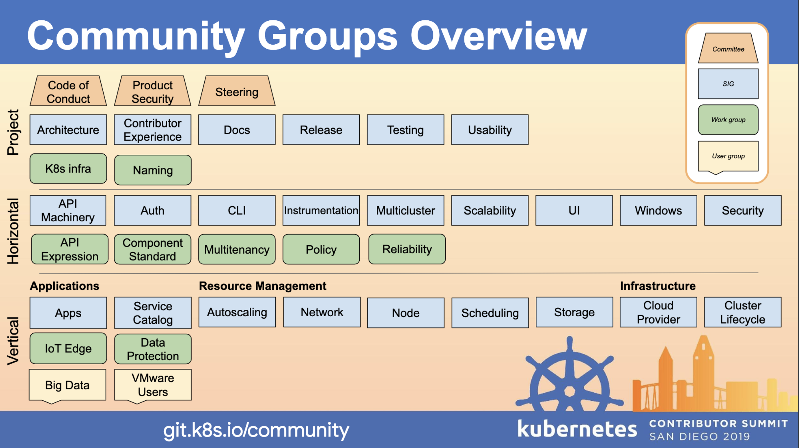

# イベント概要
Cloud Native Day Onlineのday 0 イベントとして開催された、Kubernetesコミュニティへの入り方、KubernetesへのContributeの仕方などを学べるハンズオンに参加してきました。

機会があればKubernetesにPR送りたいな、くらいのモチベーションで参加したのですが、そのハンズオンよりコミュニティ設計周りが非常に面白かったので今更ながら書き留めておきます。

# Kubernetes Communityについて
## Community Values
https://github.com/kubernetes-sigs/contributor-playground/blob/master/japan/assets/slide.pdf

コミュニティには下記の5つのValueが設定されいている

1. Distribution is better than centralization
2. Community over product or company
3. Evolution is better than stagnation
4. Automation over process
5. Inclusive is better than exclusive

順に読み解いていく

### Distribution is better than centralization
中央集権型より、分散型が好ましい

Kubernetesのコミュニティはいくつかの支局？SIGに分かれており、それぞれに明確に権限が分散されている

中央集権型の組織構造にすると、意思決定に何重もの承認プロセスが発生し、それだけスピードが損なわれるし、最終的な責任を持つ人も不明瞭で、特段品質が上がるわけではない

可能な限り権限を分散して枝葉に広がるような組織構造・意思決定プロセスを構築することが、スピーディな開発に繋がる

### Community over product or company
プロダクトや会社を超えたコミュニティ

コミュニティで活動をしているときは、「XX社のXXさん」とか「XX役職のXXさん」みたいな肩書きは一切不要

コミュニティに関わる人が、等しく議論を行い、活発に活動できる必要がある、そのためには外の肩書きは捨てる

### Evolution is better than stagnation
進化は停滞に勝る

常に変化し、前に進んでいく姿勢と、それに対する実感が得られる仕組みが重要

停滞感のある組織・プロダクトは進化をやめてしまい、時間と共に崩壊の一途を辿る

常に変化し、進化し、それを実感できるようなシステムを組織にインストールし、みんなで見れる状態にしておく必要がある

### Automation over process
プロセスよりも自動化

手動で行う作業には人為的ななんらかのミスが包含される可能性が高く、時間もかかる

定常的な作業・プロセスは可能な限り自動化し、純粋な開発に集中できるシステムを作りあげる

また、プロセスを自動化することに対して寛容な組織文化の情勢も必要（プロダクトに直接価値貢献するものではないが、長期的な視点でみた時に効果が高い）

### Inclusive is better than exclusive
排他的よりも包括的の方がよい

Imposter Syndromeは組織・コミュニティ形成における真の驚異

新規参画者や社会的マイノリティの人を積極的に受け入れ、対等にContributeできる組織文化の醸成を行う必要がある

## Community構成
コミュニティはいくつかのGroupで構成されているが、特筆すべきはSIGs（Special Interest Groups）

Project/Horizontal/Verticalの軸で多数のSIGが構成されており、Contributerはどこか興味のあるSIGで活動をすることができる

Kubernetesは巨大なプロジェクトなので、機能や専門性の単位でいくつかのWorkGroupに分割され、原則としてそれぞれが独立してComtributionできるようになっている

そうなるようにアーキテクチャも分割されているし、CodeOwnerも明確に分散されている

# 参考にすること
まず、組織設計について、下記の状態にならないように注意することは非常に参考になる

- 中央集権型になっていないか、明確な権限移譲がされていない状態になっていないか
- 包括的な文化が醸成されているか、ルールとして明文化されているか

また、開発組織としてのMVV定義を考える時に、下記の点について理想状態が定義されているかは見返すと良い

- 常に変化・進化を受け入れられるような定義になっているか
- 継続的な進化を支えるために、直接ユーザー貢献しないような活動が支援されているか

# おわり