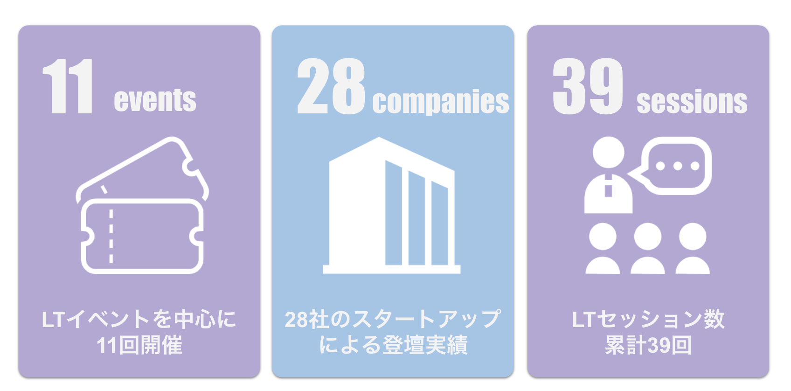
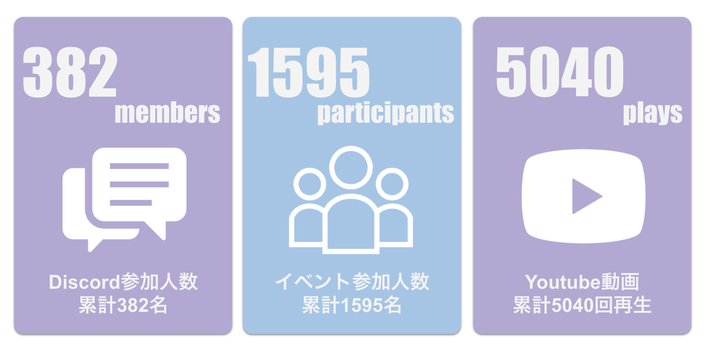

# 何を書くか
2021年も残すところあと１日。
今年もたくさんの機会を得て、学び、悩み、苦汁を嘗めたなと思います。

仕事では、1年を通してエンジニアマネージャーとして組織のこととかなんやかんやしてきました。
また、採用活動の一環としていくつかのイベントで登壇する機会もいただきました。
個人事業もちょこちょこ継続していました。
個人活動としては、AWS Startup CommunityのCoreメンバーとしてイベントの運営などに携わってきました。
在宅ワークが中心だったので、本もそれなりに読む時間が取れた気がします。

それぞれの観点でざっくり1年を振り返って書き留め、2021年末時点での自分の立ち位置の記録とします。

# 仕事（エンジニアマネージャー）
## 立ち上がり期
2020/09に現職の会社に転職し、当初はSREエンジニアとして働いていましたが、
2021/01からエンジニアマネージャーとしての任を受け、約20名のエンジニア組織のマネジメントをすることになりました。

今となっては、入社して3ヶ月、新しい会社のプロダクトもシステムもまだ全容が掴めてない中でのマネージャー就任は結構チャレンジングだったと思います。
技術的にも、基盤よりの技術スタックでこれまでやってきたので、フロント・アプリ・サーバーサイドなど多岐に亘るレイヤを知らないといけない状況に身を置いたことで、広く浅く学習する必要性が出てきて、今までとは違う動き方が最初から求められていることを感じました。

最初に手をつけたのは、メンバー全員との1on1、採用活動の介入、採用プレゼンス向上のためのTechBlog立ち上げ、プロダクト開発組織の改革、情報設計、進行中のプロジェクトの巻き取りなどでしたが、今思うともう少し現実的なステップを段階を踏んで立ち上がっていくべきだったと思います。

スタートアップだし人手は足りないし、浮いている課題は何でも拾おうというスタンスで臨んでいたのですが、マネージャーがそれでスタックしてボトルネックになると、組織としての流速が一気に落ちてしまうという視座が足りておらず、結果的にこの時着手したものは半分くらいしかうまくいかなかったと思います。

組織変更に関しては完全に失敗でした（これは個人で進めたものではないですが）。それを失敗だと広く認め、その失敗に対する振り返りを社内のドキュメントに見える形で残し、次のステップに舵を切ったのですが、そういった失敗に対する透明性は少なからず組織に対してプラスの影響を与えることができた気がしています。気がしているだけかもしれません。

## 転換期
上記の組織変更に対する失敗から、新しい組織形態への切り替えを3~4月で取り組みました。
前回の変更では力こそパワーみたいな感じで勢いよく組織の形を変更していたのですが、その時点では自分の中でシステムアーキテクチャに対する造詣が足りず、地に足のついたチーム構成にできていなかったという反省がありました。

そこで、次の組織変更では、モノリスなシステムをいくつかの仮想コンポーネントに分割し、ある程度責務分離が現実的に可能なラインで線を引き、その箱ごとにチームを作るようにしました。その際、その線の引き方に無理がないか、古参のエンジニアメンバーにもヒアリングしながら、同じ轍を踏まないように気をつけました。所謂Feature別のチーム体制への移行を目指しました。

また、Feature別のチームになると、横断課題への対処やエラートラッキング、他チームからの問い合わせコミュニケーションなどこれまで職能チームで対処していた問題が手薄になってしまうので、そこへの対応としてLiberoという輪番制の導入も実施しました。Featureチーム立ち上げ当初はそれらの問い合わせがマネージャーである僕に集中して、完全にボトルネックになっていたので、その責務を輪番担当者に分散してスピード向上と、チームを超えたコミュニケーションの場を作ることを目指しました。

これらの開発組織の変遷については、イベント登壇時に作った下記の資料にも記載しているのでよかったら見てみてください。
https://speakerdeck.com/progate/progate-icare-devmeetup

## 停滞期
新設したFeature別のチームと、Libero体制の2軸で、プロダクト開発チームとしては比較的回るようになってきたかなという頃、マネージャーの宿敵業務、評価の時期が訪れました。

僕は、自分が誰かを評価できるほどの人間だと思ってないし、技術的にも自分より強い人たちだらけの組織の中で、何を持って評価者として立ち回るべきなのかがわからず、かなり辛い思いをした記憶があります。

一方で、会社の限られた原資を最も全体公平性が高く、納得感を得られるように分配するために、何らかの評価の仕組みが必要であることも理解はしていて、この狭間にいて思考する期間はなかなか辛い時期でした。
コンフリクトが全くなかったとは言いません。苦渋の決断と、シビアなコミュニケーションが求められる場でもあるので、そこの慎重性など、普段頭を使わない領域にエネルギーを注入しないといけないので相当なストレスがかかっていたと思います。

これまで年間を通じて、オフタイムにも仕事に関連する本を読んだり、イベントに顔を出したりして、学ぶことに時間を全振りするようにしてきていたのですが、停滞期を迎えてから、メンタルを中央に保つことが最も重要だと感じ、趣味の小説を読んだり、ゲームをしたり、子どもとの時間を確保したりすることも心がけてきました。マインドフルネスな状態で仕事に臨むのが最もパフォーマンスが出るという、よく本で見る話を身を持って知ることができました。

## これから
この1年マネージャーとしての仕事を継続してきましたが、正直まだ慣れているとは全く思っていません。

エンジニアとして働いていた時と報酬系の働き方が全然違うので、達成感を得られることも少ないし、シビアな意思決定・コミュニケーションはこれからもたくさん求められるので、神経をすり減らしていかないといけない状況に変わりはないと思います。

一方で、この1年でかなり成長したと思う点も多々あるので、来年はその成長幅を強みに変えて、報酬系をマネジメント業務に切り替え、より組織としての成果が最大化できるような取組へのチャレンジや、もっと大規模な組織マネジメントへの挑戦を進めていきたいと思います。
まぁ新年の抱負はまた別途。

# 仕事（個人事業）
本業でマネージャー始めたので、個人事業はセーブ気味に動いていました。

前からずっとお世話になっている会社でのデータエンジニアとしての業務に加え、特許法務系の課題で手伝って欲しいと知人に頼まれた時にスポットで入るくらいでした。

なので、個人事業を通じて新しい知見が得られた、という機会も少なく、技術に触れる機会を残すという観点で細々とやってきた感じです。

来年は更に個人事業へのコミット量を調整しないと身がもたないなと思っています。要検討。

# 登壇したイベント
今年はいくつか大きめのイベントに登壇させていただく機会がありましたので備忘的に記載します。

## AWS Dev Day
2021/09に開催された、AWS Dev Dayに登壇の機会をいただきました。

特に話す内容を考えずにCfP出したら通ってしまったので、自社プロダクトのアーキテクチャ紹介と、新規事業のコンセプト紹介をさせていただきました。

資料と動画が残っています。

https://speakerdeck.com/progate/aws-dev-day2021

https://www.youtube.com/watch?v=6Uc5m2HF-xs

## DevRel Japan Conference
DevRel Japanという、開発者コミュニティ活性化を目指している団体のイベントがあり、資格・教育というテーマでの座談会に登壇させていただきました。

技術的な話とか組織マネジメントの話とかとは離れて、教育に携わっている方で集まってメタな話をしたのは非常に面白かったです。とても学びになったイベントでした。

https://devrel.tokyo/japan-2021/

## iCARE Meetup
株式会社iCAREさん主催のイベントに登壇者として参加させていただきました。

ここでは組織マネジメント観点での話をさせていただいたのですが、配信終了後のオフトークでマネージャー・VPoX・CxOならではのかかえる課題あるあるトークでめちゃくちゃ盛り上がって、別で飲みに行こうという話になりました。やっぱりみんな大変ですね。

https://icare.connpass.com/event/228441/

こちらも動画と資料が残ってます。

https://www.youtube.com/watch?v=VZmBldDlo1Y

https://speakerdeck.com/progate/progate-icare-devmeetup

# コミュニティ活動

2021/02から、AWS Startup Communityというコミュニティで、Core Memberとしての活動に参加させてもらっています。

https://aws-startup-community.connpass.com/

月に一回ほどイベントを実施し、元々はそのイベントのTwitter実況要員だったのですが、最近ではイベントのMCを担当するようになり、ますます楽しくなってきています。
コミュニティも1年で大きく成長し、来年もライフワークとして力を割いていきたいと思ってます。

年末の振り返りイベントでコミュニティの変遷をインフォグラフィック的にまとめてみたのでこちらでも残しておきます。

また、ここでの活動をAWSにも認めてもらい、AWS Community Builderというロールももらえています。
引き続きコミュニティ活動を頑張れというお達しですね。。

# 印象に残っている本をいくつか

話は変わって、今年は結構本を読めたなと思います。
中でも印象に残っている本をいくつか列挙していきます。

## 技術系
- [Go言語でつくるインタプリタ](https://www.amazon.co.jp/gp/product/4873118220/ref=ppx_yo_dt_b_asin_title_o08_s00?ie=UTF8&psc=1)
  - 完走はしていないですが、インタプリタを実装することでスクリプト型の言語がどうやって動いているのかの仕組みをざっくりと理解できました
- [データマネジメントが30分でわかる本](https://www.amazon.co.jp/gp/product/B085W4YSZJ/ref=ppx_yo_dt_b_d_asin_title_o01?ie=UTF8&psc=1)
  - 所謂DMBOKの要約本です。DMBOK全部読むのはかなりハードル高いので、簡潔にまとめてくれていて助かりました。
- [オープンソースの教科書](https://www.amazon.co.jp/gp/product/4863543581/ref=ppx_yo_dt_b_asin_title_o03_s00?ie=UTF8&psc=1)
  - RailsのGPL汚染問題をきっかけに、ちゃんとOSSのことを知ろうと思って書いました。
- [Kubernetes完全ガイド 第2版](https://www.amazon.co.jp/gp/product/4295009792/ref=ppx_yo_dt_b_asin_title_o03_s00?ie=UTF8&psc=1)
  - 仕事でk8sを触ることになったので、インデックス張るために購入しました。結果的に自宅でkubernetes環境作るくらいにはなってしまいました。
  - https://tech.prog-8.com/entry/2021/12/01/115100

## マネジメント系
- [1兆ドルコーチ](https://www.amazon.co.jp/gp/product/4478107246/ref=ppx_yo_dt_b_asin_title_o00_s00?ie=UTF8&psc=1)
  - コーチングの信念のようなものをこの本から学び、メンバーとの関わり方にとても影響を受けました。
- [Measure What Matters](https://www.amazon.co.jp/gp/product/4532322405/ref=ppx_yo_dt_b_asin_title_o05_s00?ie=UTF8&psc=1)
  - OKRの金字塔のような本です、OKRの運用は導入してから課題が多いので繰り返し読みたい本。
- [爆速成長マネジメント](https://www.amazon.co.jp/gp/product/429600011X/ref=ppx_yo_dt_b_asin_title_o03_s00?ie=UTF8&psc=1)
  - マネージャーレイヤーというより、経営レイヤーとしての話が多い本でしたが、CEOをいかにサポートしていくのかという観点で視座がグッと引き上げられた本でした。
- [ユニコーン企業のひみつ](https://www.amazon.co.jp/gp/product/4873119464/ref=ppx_yo_dt_b_asin_title_o09_s00?ie=UTF8&psc=1)
  - 今の組織を作る上で一番参考にした本です。Feature型チームと職能チームのバランスの取り方を特に参考にしました。
- [Scaling Teams 開発チーム 組織と人の成長戦略](https://www.amazon.co.jp/gp/product/4839970459/ref=ppx_yo_dt_b_asin_title_o00_s00?ie=UTF8&psc=1)
  - 組織構築だけでなく、採用育成観点での開発組織の作り方について要点を書いてくれています。何か迷った時にリファレンスにしたいと思って手元に近いところに置いています。
- [恐れのない組織――「心理的安全性」が学習・イノベーション・成長をもたらす](https://www.amazon.co.jp/gp/product/4862762883/ref=ppx_yo_dt_b_asin_title_o09_s00?ie=UTF8&psc=1)
  - 心理的安全性とは何なのか、自分の中でもモヤモヤしていた観点を時ほぐしてくれるような本でした。HowTo本ではなく、思考として定着させるのに適している本だと思います。
- [その「エンジニア採用」が不幸を生む](https://www.amazon.co.jp/gp/product/4774186015/ref=ppx_yo_dt_b_asin_title_o05_s00?ie=UTF8&psc=1)
  - 組織を作る上でのキーになる採用、特にエンジニア採用の難しさを業務の中で痛感しているので、そこに対する知見があればと思い手に取りました。
- [Debugging Teams: Better Productivity through Collaboration](https://www.amazon.co.jp/gp/product/B016NDL1QE/ref=ppx_yo_dt_b_d_asin_title_o05?ie=UTF8&psc=1)
  - 英語ですが、本質的に「いいチーム」を作るための考え方がよく纏まっている本でした。Team Geekの続編です。
- [Googleのソフトウェアエンジニアリング](https://www.amazon.co.jp/gp/product/4873119650/ref=ppx_yo_dt_b_asin_title_o03_s00?ie=UTF8&psc=1)
  - これはまだ読んでいる途中ですが、上で読んできたマネジメント系の本や業務で得た知見を体型的に整理していくのに使えそうな、大作本です。
- [チームトポロジー 価値あるソフトウェアをすばやく届ける適応型組織設計](https://www.amazon.co.jp/gp/product/4820729632/ref=ppx_yo_dt_b_asin_title_o04_s00?ie=UTF8&psc=1)
  - これもまだ読み途中ですが、今の組織形態から一つステップアップしたいと思った時に、ヒントになりそうな話が多く載っていそうな感じがしています。

## 小説系
- [medium 霊媒探偵城塚翡翠](https://www.amazon.co.jp/-/en/%E7%9B%B8%E6%B2%A2-%E6%B2%99%E5%91%BC/dp/4065249716/ref=sr_1_1?crid=8EAQ0T8YIBGA&keywords=medium&qid=1640869222&sprefix=mediu%2Caps%2C262&sr=8-1)
- [invert 城塚翡翠倒叙集](https://www.amazon.co.jp/gp/product/4065237327/ref=ppx_yo_dt_b_asin_title_o00_s00?ie=UTF8&psc=1)
  - この2冊は続きものですが、めちゃくちゃ面白いです。最終章で世界がひっくり返るような体験ができます。
- [恋と禁忌の述語論理](https://www.amazon.co.jp/gp/product/B07L4C49TJ/ref=ppx_yo_dt_b_d_asin_title_o01?ie=UTF8&psc=1)
  - 数理論理学を用いて事件の「検証」をしていくという、ちょっと変わった安楽椅子探偵系小説です。かなり大きめの叙述トリックも使われています。
- [六人の嘘つきな大学生](https://www.amazon.co.jp/gp/product/B08WH2GDBF/ref=ppx_yo_dt_b_d_asin_title_o09?ie=UTF8&psc=1)
  - 今年No1かなと思うくらい引き込まれた作品でした。リアルにページを捲る手が止まらなくて、一晩で完読しました。仕事に影響が出ました。
- [向日葵の咲かない夏](https://www.amazon.co.jp/gp/product/B0096PE4CU/ref=ppx_yo_dt_b_d_asin_title_o00?ie=UTF8&psc=1)
  - 少し昔の本ですが、読んだことがなかったので読んでみました。ラストシーンのもやもやがまだ胸につっかえている感じがします。良い意味です。
- [変な家](https://www.amazon.co.jp/gp/product/4864108455/ref=ppx_yo_dt_b_asin_title_o08_s00?ie=UTF8&psc=1)
  - さらっと読める割に、すごくゾッとする本でした。この後、作者の雨穴さんのYoutubeを見漁りました。
- [私たちが星座を盗んだ理由](https://www.amazon.co.jp/gp/product/B00KRA3GJU/ref=ppx_yo_dt_b_d_asin_title_o03?ie=UTF8&psc=1)
  - ミステリー短編集ですが、1話目のラスト数ページの裏切られた感、ゾクっとする感じがミステリー好きには快感だと思います。
- [ザリガニの鳴くところ](https://www.amazon.co.jp/-/en/%E3%83%87%E3%82%A3%E3%83%BC%E3%83%AA%E3%82%A2%E3%83%BB%E3%82%AA%E3%83%BC%E3%82%A8%E3%83%B3%E3%82%BA-ebook/dp/B0859CYBKY/ref=sr_1_1?keywords=%E3%81%96%E3%82%8A%E3%81%8C%E3%81%AB%E3%81%AE%E9%B3%B4%E3%81%8F%E3%81%A8%E3%81%93%E3%82%8D%E6%9C%AC&qid=1640869186&sprefix=zarig%2Caps%2C183&sr=8-1)
  - 世界的に超売れていた本なので買ってみました。普段こういうジャンルの本はあまり読まないのですが、そら売れるわ・・という感想です。他人の一生を体験でき、自分の人生観についても問いかけられます。
- [かがみの孤城](https://www.amazon.co.jp/-/en/%E8%BE%BB%E6%9D%91-%E6%B7%B1%E6%9C%88/dp/4591153320/ref=sr_1_2?crid=34I70R7VFGIE0&keywords=%E9%8F%A1%E3%81%AE%E5%AD%A4%E5%9F%8E&qid=1640869276&sprefix=%E9%8F%A1%E3%81%AE%2Caps%2C209&sr=8-2)
  - これもページを捲る手が止まりませんでした。大枠の仕掛けは読んでいる途中にわかってしまったのですが、それでも最後の結末と感動は相当なものでした。

## その他
- [数学クラスタが集まって本気で大喜利してみた](https://www.amazon.co.jp/gp/product/4046048883/ref=ppx_yo_dt_b_asin_title_o01_s00?ie=UTF8&psc=1)
  - めっちゃマニアックな数学知識を駆使して大喜利をするという、あまり一般受けしなさそうな本ですが、高校・大学の数学が好きなら楽しめると思います。
- [未完のファシズム](https://www.amazon.co.jp/gp/product/410603705X/ref=ppx_yo_dt_b_asin_title_o08_s00?ie=UTF8&psc=1)
  - 第二次世界大戦時、なぜ日本があんな無謀な意思決定に向かっていったのか、それは大正から続く小さな意思決定の歪みの積み重ねだった、というのが戦史として丁寧に解説されています。歴史観が変わる良書でした。
- [クイズ思考の解体](https://www.amazon.co.jp/gp/product/4023319821/ref=ppx_yo_dt_b_asin_title_o00_s00?ie=UTF8&psc=1)
  - YoutuberのQuizKnockが、彼らの活動初期から大ファンなのですが、その代表を勤める伊沢さんがクイズについての解説本を書いたとのことで買わざるを得ませんでした。クイズ的な思考法がすごく丁寧に記載されています。活用する場は僕にはなさそうです。
- [暇な人、謎解きでもしませんか？](https://www.amazon.co.jp/gp/product/B09KRFNMJF/ref=ppx_yo_dt_b_d_asin_title_o00?ie=UTF8&psc=1)
  - Twitterで有名な暇謎さんの謎解き本です。暇謎さんはかなり本格的な謎解きを常に作成されていて、この本も期待通り骨のある問題がたくさんあり、楽しめました。
- [教養としての東大理科の入試問題](https://www.amazon.co.jp/-/en/%E7%AB%B9%E7%94%B0-%E6%B7%B3%E4%B8%80%E9%83%8E/dp/486064669X/ref=sr_1_1?crid=1ZWZN43UP09XD&keywords=%E6%9D%B1%E5%A4%A7%E7%90%86%E7%A7%91&qid=1640869163&sprefix=%E6%9D%B1%E5%A4%A7+%E7%90%86%E7%A7%91%2Caps%2C225&sr=8-1)
  - 理科全般（物理・化学・生物・地学）の教養本として、東大の過去問に沿って知識体系を再構築してくれる本です。もう忘れているはずの有機化学とかも、読んでて懐かしい気持ちになりつつ、知識がアップデートされていきました。

 # 最後に
 誰向けでもない、僕のための振り返りPostでした。
 
 2021年の自分が何を考え、何を成してきたのか記録として残しておきます。2022年の抱負はまた別途何か考えていこうと思います。